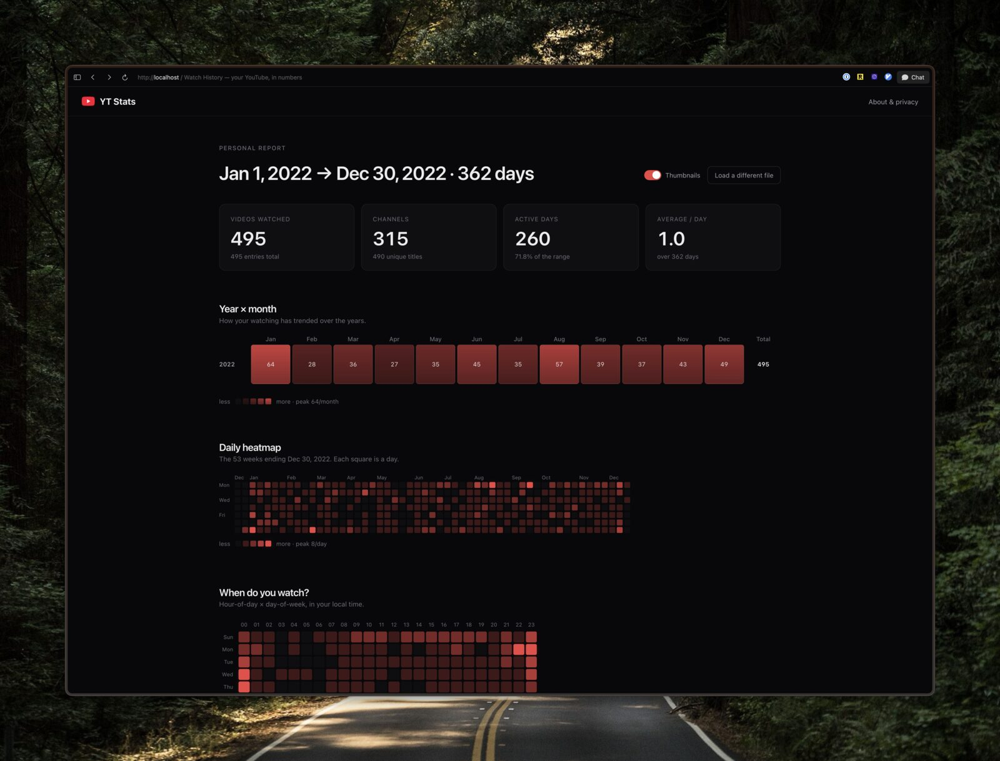

# YT stats &middot; <small>Spotify Wrapped, but for YouTube</small>



**Spotify Wrapped, but for YouTube.** Drop your `watch-history.json` and get a personal report: years of viewing trends, a daily heatmap, top channels (all-time and last 90 days), most-rewatched videos, hour-of-day patterns, streaks. All of it rendered in your browser — or in your terminal — without a single network request.

There's a web app (drag-and-drop, dark themed) and a Deno CLI that prints the same stats as ASCII.

## Privacy, up front

This is the whole pitch:

- **No server.** The web app is static HTML/CSS/JS.
- **No telemetry, no analytics, no cookies, no CDN fonts.**
- **No network requests** while the app runs — open the Network tab and watch.
- **Parsing happens locally** via the browser's File API.
- **Refresh = gone.** Nothing is persisted.

Channel avatars are deterministic gradients hashed from the channel name — never fetched from YouTube.

## Get your watch-history.json

1. Sign in to [Google Takeout](https://takeout.google.com/).
2. **Deselect all**, then tick only **YouTube and YouTube Music**.
3. Click **All YouTube data included** → **Deselect all** → tick **history** → choose **JSON** (not HTML).
4. Create the export, wait for the email, download and unzip.
5. The file lives at `Takeout/YouTube and YouTube Music/history/watch-history.json`.

The web app has the same walkthrough at `/about.html#takeout`.

## Web app

```sh
cd web
python3 -m http.server 4173
# open http://localhost:4173
```

Drop your `watch-history.json` on the page. The report renders in a few hundred ms.

## CLI

Requires [Deno](https://deno.com/) (tested on 2.7+).

```sh
deno run --allow-read yt-stats.ts watch-history.json
```

Or make it executable:

```sh
chmod +x yt-stats.ts
./yt-stats.ts watch-history.json
```

## What you get

- Total watches, year range, unique channels, unique videos
- Year × month grid
- Daily heatmap (last 53 weeks, GitHub-style)
- Hour-of-day × day-of-week matrix
- Top channels (all-time and last 90 days)
- Most-rewatched videos
- Play-count distribution (1, 2, 3–5, 6–10, …, 51+)
- Longest watching streak

Times are local. Ads, posts, and YouTube Music entries are filtered out.

## Project layout

```
core.js       Pure stats engine — runs in Deno and the browser
cli.js        ANSI/ASCII renderer for the terminal
yt-stats.ts   Deno entry point (7 lines, wires core + cli)
web/          Static web app — index.html, about.html, app.js, styles.css
              core.js here is a symlink to ../core.js
```

`core.js` has no dependencies and no I/O. `cli.js` writes ANSI to stdout. `web/app.js` renders into the DOM. Swap renderers freely.

## License

MIT.
